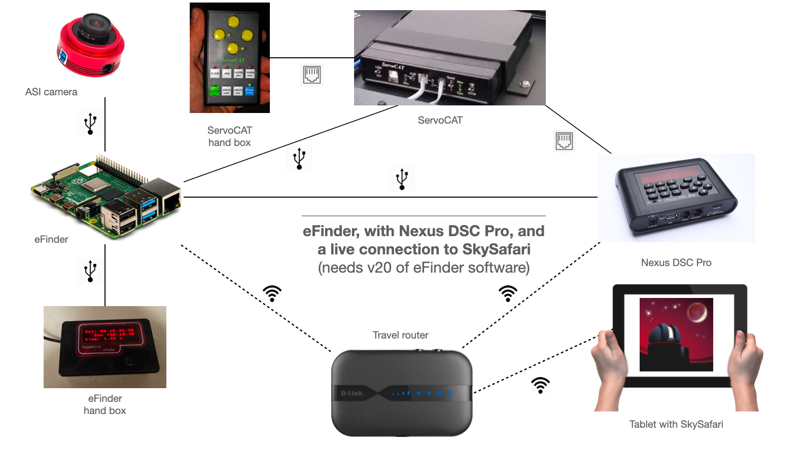
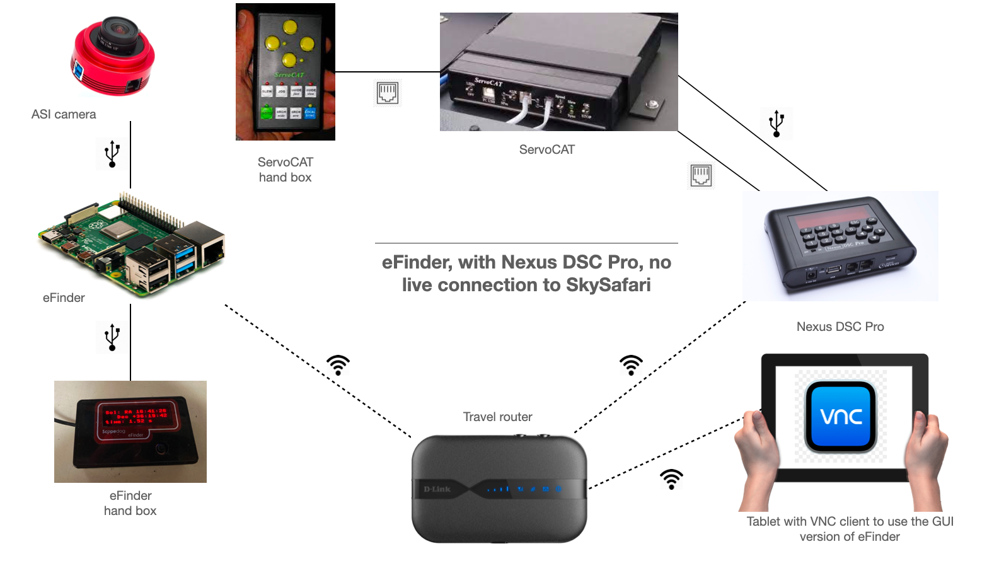
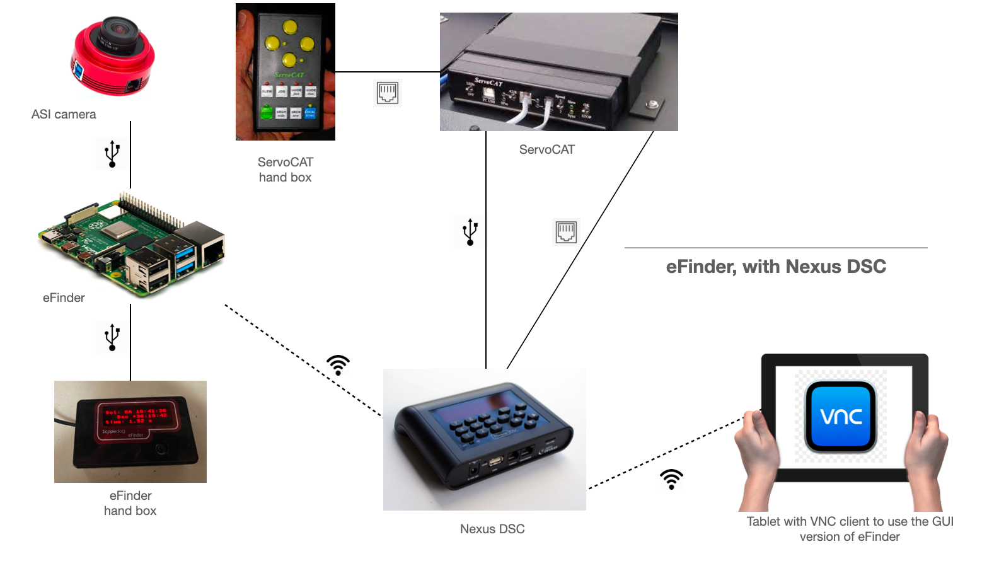
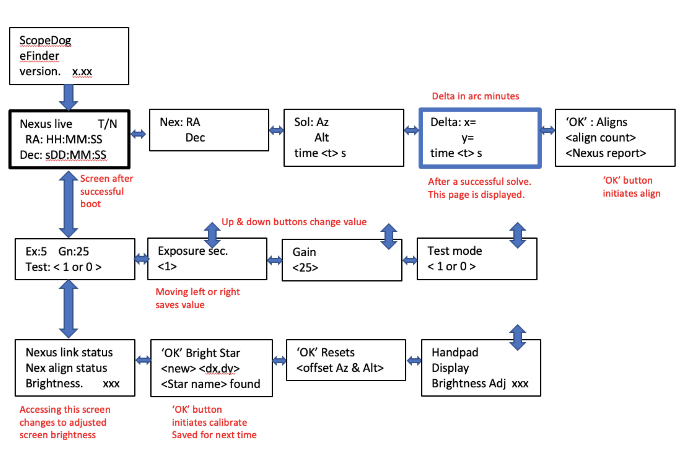

# ScopeDog eFinder

- [ScopeDog eFinder](#scopedog-efinder)
  - [Mailing list](#mailing-list)
  - [Source code](#source-code)
  - [Needed parts](#needed-parts)
    - [Purchase of the hardware](#purchase-of-the-hardware)
  - [eFinder hardware configurations](#efinder-hardware-configurations)
    - [Nexus DSC Pro, using SkySafari](#nexus-dsc-pro-using-skysafari)
    - [Nexus DSC Pro, without using SkySafari](#nexus-dsc-pro-without-using-skysafari)
    - [Nexus DSC, using SkySafari](#nexus-dsc-using-skysafari)
    - [Nexus DSC, without using SkySafari](#nexus-dsc-without-using-skysafari)
  - [Nexus DSC Pro](#nexus-dsc-pro)
    - [Update of the Nexus DSC Pro firmware](#update-of-the-nexus-dsc-pro-firmware)
    - [Network settings on the Nexus DSC Pro](#network-settings-on-the-nexus-dsc-pro)
      - [Specific settings on the Nexus DSC Pro](#specific-settings-on-the-nexus-dsc-pro)
      - [Connecting the Nexus DSC Pro to the eFinder using USB](#connecting-the-nexus-dsc-pro-to-the-efinder-using-usb)
  - [Software](#software)
    - [Raspberry Pi 4](#raspberry-pi-4)
      - [Install OS and needed dependencies](#install-os-and-needed-dependencies)
      - [Install astrometry.net](#install-astrometrynet)
      - [Install the ZWO ASI Linux SDK](#install-the-zwo-asi-linux-sdk)
      - [Start eFinder automatically after boot](#start-efinder-automatically-after-boot)
      - [Create a RAM disk on the Raspberry Pi](#create-a-ram-disk-on-the-raspberry-pi)
      - [Install RTL8192EU driver for the TP-LINK TL-WN823N](#install-rtl8192eu-driver-for-the-tp-link-tl-wn823n)
      - [The Raspberry Pi Pico handbox](#the-raspberry-pi-pico-handbox)
    - [Changelog](#changelog)
  - [Hardware](#hardware)
    - [Adding the OLED display to the Raspberry Pi Pico](#adding-the-oled-display-to-the-raspberry-pi-pico)
    - [Adding the little joystick to the Raspberry Pi Pico](#adding-the-little-joystick-to-the-raspberry-pi-pico)
    - [Insert the Raspberry Pi Pico in a nice box](#insert-the-raspberry-pi-pico-in-a-nice-box)
    - [Mounting the eFinder on the telescope](#mounting-the-efinder-on-the-telescope)
  - [Testing the eFinder](#testing-the-efinder)
    - [Testing the eFinder outside](#testing-the-efinder-outside)
    - [Connect to the Nexus DSC wifi](#connect-to-the-nexus-dsc-wifi)
    - [How to work with the handpad](#how-to-work-with-the-handpad)
      - [In the VNC GUI version](#in-the-vnc-gui-version)
      - [In the handpad version](#in-the-handpad-version)
  - [Development environment](#development-environment)

## Mailing list

For more help, you can subscribe to the eFinder mailing list at [groups.io](https://groups.io/g/eFinder).

## Source code

- The source code can be downloaded from [GitHub](https://github.com/WimDeMeester/eFinder/releases/latest).

## Needed parts

### Purchase of the hardware

In the following list, you can see which hardware is needed to construct a working eFinder. 

The Nexus DSC Pro cannot connect directly over WiFi to more than one machine (e.g. the eFinder and a tablet running SkySafari). To solve this, you can use an external router. The D-Link router is not needed if you use the Nexus DSC, as the problem does not occur on the Nexus DSC.

The Raspberry Pi has a poor WiFi connection when it is in a case. To improve the connection, you can add an external WiFi adapter. The TP-Link adapter is a good option. Instructions on how to set up the adapter are provided later in this document.

Since I live in Belgium, this section is focused on European suppliers.  I purchased the ASI camera at Teleskop Service in Germany, and the rest of the components from suppliers in the Netherlands (Raspberrystore) or Amazon.

| Ordered    | Product                                                                                                                                                                                    | Company           | Amount   | Arrival    |
| ---------- | ------------------------------------------------------------------------------------------------------------------------------------------------------------------------------------------ | ----------------- | -------- | ---------- |
| 03/08/2022 | Software                                                                                                                                                                                   | Keith Venables    | € 26.98  | 03/08/2022 |
| 03/08/2022 | [ASI120MM-S](https://www.teleskop-express.de/shop/product_info.php/info/p7109)                                                                                                             | Teleskop Service  | € 248.51 | 11/08/2022 |
| 03/08/2022 | [Raspberry Pi 4 model B - 4GB](https://www.raspberrystore.nl/PrestaShop/nl/raspberry-pi-v4/228-raspberry-pi-4b4gb-765756931182.html?search_query=Raspberry+Pi+4+model+B+-+4GB&results=203) | Raspberrystore.nl | € 74.95  | 10/08/2022 |
| 03/08/2022 | [Raspberry Pi Pico](https://www.raspberrystore.nl/PrestaShop/nl/raspberry-pi-pico/312-raspberry-pi-pico-0617588405587.html?search_query=Raspberry+Pi+4+Pico&results=203)                   | Raspberrystore.nl | € 3.99   | 10/08/2022 |
| 03/08/2022 | [2 x 1x40 header](https://www.raspberrystore.nl/PrestaShop/nl/raspberry-pi-pico/320-soldeerpennen-1x40-voor-de-raspberry-pi-pico.html?search_query=1x40+header&results=44)                 | Raspberrystore.nl | € 2.00   | 10/08/2022 |
| 03/08/2022 | Shipping costs Astroberrystore.nl                                                                                                                                                          | Raspberrystore.nl | € 12.74  | 10/08/2022 |
| 03/08/2022 | [2.23 OLED Display Module for Raspberry Pi Pico](https://www.amazon.nl/gp/product/B093SYSX5S/ref=ppx_od_dt_b_asin_title_s00?ie=UTF8&psc=1)                                                 | Amazon (.nl)      | € 20.99  | 09/08/2022 |
| 03/08/2022 | [Geekworm Raspberry Pi 4 Aluminum Case](https://www.amazon.nl/gp/product/B07ZVJDRF3/ref=ppx_od_dt_b_asin_title_s01?ie=UTF8&psc=1)                                                          | Amazon (.nl)      | € 14.89  | 08/08/2022 |
| 03/08/2022 | [Sandisk Ultra 32 GB microSDHC](https://www.amazon.nl/gp/product/B08GY9NYRM/ref=ppx_od_dt_b_asin_title_s02?ie=UTF8&psc=1)                                                                  | Amazon (.nl)      | € 8.01   | 08/08/2022 |
| 03/08/2022 | [100 x 60 x 25 mm DIY box](https://www.amazon.nl/gp/product/B07V2Q32H8/ref=ppx_od_dt_b_asin_title_s02?ie=UTF8&psc=1)                                                                       | Amazon (.nl)      | € 10.62  | 08/08/2022 |
| 03/08/2022 | [Lon0167  Momentary Circuit Control Tactile Tact Push Button Switch](https://www.amazon.nl/gp/product/B0842JYXC8/ref=ppx_yo_dt_b_asin_title_o00_s00?ie=UTF8&psc=1)                         | Amazon (.nl)      | € 11.31  | 16/08/2022 |
| 03/08/2022 | [50 mm F1.8 CCTV-lens for C-mount](https://www.amazon.nl/gp/product/B08BF7DRXR/ref=ppx_yo_dt_b_asin_title_o02_s00?ie=UTF8&psc=1)                                                           | Amazon (.nl)      | € 48.38  | 16/08/2022 |
| 10/10/2022 | [TP-Link 300 Mbps Wifi USB-adapter (TL-WN823N)](https://www.amazon.nl/dp/B0088TKTY2/ref=pe_28126711_487805961_TE_item)                                                                     | Amazon (.nl)      | € 9.95   | 11/10/2022 |
| 12/06/2023 | [D-Link DWR-932](https://www.amazon.com.be/dp/B00OVJDCQ0/ref=pe_43847721_689504491_TE_item)                                                                                                | Amazon (.com.be)  | € 54.83  | 14/06/2023 |
|Total       |                                                                                                                                                                                            |                   | € 548.15 |            |

## eFinder hardware configurations

The eFinder can be added to your telescope system in a variety of ways, depending on your specific needs and preferences.

### Nexus DSC Pro, using SkySafari

A travel router is required when using SkySafari on a tablet with the Nexus DSC Pro.  This is the needed hardware configuration:

- The ServoCAT is connected directly to the eFinder using USB.  
- The ServoCAT is also connected to the Nexus DSC Pro using a serial cable.
- The ASI camera and the eFinder hand box are connected directly to the eFinder using USB. 
- The Nexus DSC Pro is connected to the eFinder using USB. 
  
**Please use the following steps to install the eFinder**

- [Install the Raspberry Pi 4](#raspberry-pi-4)
- [Create a RAM disk to store the index files](#create-a-ram-disk-on-the-raspberry-pi)
- If using an external Wifi adapter, [install the needed firmware](#install-rtl8192eu-driver-for-the-tp-link-tl-wn823n)
- [Install the latest firmware to the hand box](#the-raspberry-pi-pico-handbox)
- [Connect the Nexus DSC Pro to the eFinder using USB](#connecting-the-nexus-dsc-pro-to-the-efinder-using-usb)
- [Update the Nexus DSC Pro to the latest firmware](#update-of-the-nexus-dsc-pro-firmware)
- [Set up the Nexus DSC Pro](#specific-settings-on-the-nexus-dsc-pro)



###  Nexus DSC Pro, without using SkySafari

If you want to connect your tablet to the eFinder (for the GUI) then for the Nexus DSC Pro, you need a travel router. For the non Pro, the Nexus can act as a router.



### Nexus DSC, using SkySafari

When using a Nexus DSC, a travel router is not required when using SkySafari on a tablet.


### Nexus DSC, without using SkySafari

When using a Nexus DSC, a travel router is not required when using SkySafari on a tablet.



## Nexus DSC Pro

### Update of the Nexus DSC Pro firmware

- Remove the micro SD card from the Nexus DSC Pro.
- Insert the micro SD card into a card reader of your computer.
- Make sure that at least version 1.1.20 of the firmware is installed on your Nexus DSC Pro.  If this is not the case, download the latest version of the firmware from the Nexus DSC pro webpage and copy the firmware image (nxpro.fw) to the micro SD card.
- Make sure you properly eject the micro SD card from your computer.
- Insert the micro SD card back into the slot of the Nexus DSC Pro.
- Press and hold the OK button and turn the Nexus DSC Pro.
- A screen is shown asking if it is OK to update the firmware.  Press OK and wait till the update is completed.
- In the info menu, the correct version of the firmware should be shown (1.1.20).  The needed firmware version for the Nexus DSC is 1.4.14.

### Network settings on the Nexus DSC Pro

Make sure the following settings are set on the Network page:

- WiFi Mode: Access Point
- DHCP: Disabled
- SSID: Name the network
- Password: Select a password or leave blank
- Channel: 6 (The channel needs to be 6 to be able to connect the eFinder, a VNC client, and SkySafari on a tablet)
- Protocol: LX200 (ServoCAT will not connect with the eFinder)

#### Specific settings on the Nexus DSC Pro

- Change the Serial connection to ServoCAT, 19200, 8, 1, None
- Change the USB connection from ServoCat to LX200, 9600, 8, 1, None
- Change Wifi to connect to Travel Router
  - Infrastructure, set SSID, Password, DHCP Disabled
  - Channel: 6
  - IP Address: 192.168.0.19
  - Mask: 255.255.255.0
  - Gateway: 192.168.0.1
  - Protocol: LX200
  - TCP port: 4060
  - Use EPOCH: JNow

#### Connecting the Nexus DSC Pro to the eFinder using USB

*This is only needed when using a Nexus DSC Pro and SkySafari on a tablet!*

As the Nexus DSC Pro is a host, a ttl to USB adapter is needed (from [amazon.co.uk](https://www.amazon.co.uk/gp/product/B08ZS4PHNL) or [amazon.com.be](https://www.amazon.com.be/-/nl/4-pins-PL2303-kabelmodule-4-polige-PL2303HX/dp/B07LH6NJSZ)). This cable should be connected directly to the GPIO pins of the Raspberry PI, as described in the following table:

| Raspberry Pi GPIO Pin |                        | 
|-----------------------|------------------------|
| GND                   | USB to TTL lead, black | 
| 14                    | USB to TTL lead, green | 
| 15                    | USB to TTL lead, white | 
| Not used              | USB to TTL lead, red   | 

The USB converter is powered via the USB from the Nexus. Do not have the red wire connected.

The pinout is as in the following picture:


Enable ’serial’ on the Pi raspi-config set up:

```bash
sudo raspi-config
```

Select *Interface Options*, *Serial Port*, *No Login Shell*, *Enable Serial Port hardware*

The Nexus USB communication should be set to LX200, 9600,8,1,N

A useful test is to use the Nexus DSC in test mode monitoring the USB port, when switching on the eFinder. You should see the traffic as the eFinder asks for geo data etc. If not switch the green and white wires on the UART to USB cable.

## Software

### Raspberry Pi 4

#### Install OS and needed dependencies

- Download the [Raspberry Pi Imager](https://www.raspberrypi.com/software/)
- Install the standard 32bit Raspberry Pi OS.
- Enter *efinder* as username, *efinder* as password.
- Install applications

```bash
# For remote Finder access from a Mac
sudo apt install netatalk

sudo apt install libatlas3-base libbz2-dev libcairo2-dev libnetpbm10-dev netpbm libpng-dev libjpeg-dev zlib1g-dev swig libcfitsio-dev imagemagick python3-pil.imagetk

# Install the needed python libraries
pip install numpy==1.23.1
pip install fitsio
pip install astropy
pip install pyfits
pip install Skyfield
```

- Configure netatalk.  Using netatalk, you can select *Network* in the macOS Finder and select *raspberry* to see the contents of the /home directory of the Raspberry Pi on your Mac. Make sure the */etc/netatalk/afp.conf* configuration file is as follows:

```bash
[Homes]
 basedir regex = /home
```

- Restart netatalk:

```bash
sudo systemctl restart netatalk
```

- Edit */etc/profile*. Add the following line to the end of the file:

```bash
export PATH=/home/efinder/.local/bin:/usr/local/astrometry/bin:$PATH
```

- Remove the need for password during code execution:

```bash
sudo visudo
```

- Add the following line to the end:

```bash
efinder ALL = NOPASSWD: /bin/date, /sbin/reboot
```

- Add the needed folders for the eFinder software.

```bash
mkdir ~/Solver
mkdir ~/Solver/images/
mkdir ~/Solver/Stills/
```

- Checkout the eFinder software from GitHub

```bash
cd ~
git clone git@github.com:WimDeMeester/eFinder.git Solver
```

- Reboot

#### Install astrometry.net

- Download the latest version (0.91) of astrometry.net from [GitHub](https://github.com/dstndstn/astrometry.net/releases/tag/0.91).
- Unpack the tar.gz file

```bash
tar zxvf astrometry.net-0.91.tar.gz
```

- Build astrometry.net

```bash
cd astrometry.net-0.91
sudo make
sudo make py
sudo make extra
sudo make install
```

- Copy some index and catalog files:

```bash
sudo cp /home/efinder/Downloads/ver\ 11\ non-astroberry\ Raspian\ build/Indices/index-41* /usr/local/astrometry/data/
sudo cp -r /home/efinder/Downloads/ver\ 11\ non-astroberry\ Raspian\ build/annotate_data/ /usr/local/astrometry/
```

#### Install the ZWO ASI Linux SDK

- Download the SDK from the Developer tab of the [driver page](https://astronomy-imaging-camera.com/software-drivers).
- Unpack the SDK:

```bash
bunzip2 ASI_linux_mac_SDK_V1.26.tar.bz2
tar xvf ASI_linux_mac_SDK_V1.26.tar
cd ASI_linux_mac_SDK_V1.26/lib/
sudo mkdir /lib/zwoasi
sudo cp -r * /lib/zwoasi/
sudo install asi.rules /lib/udev/rules.d
pip3 install zwoasi
```

#### Start eFinder automatically after boot

- Find the PATH

```bash
echo $PATH
```

- Adapt crontab:

```bash
crontab -e
```

- Add the PATH and the DISPLAY variable to the crontab

```bash
export PATH=<The returned path from the echo $PATH command>
DISPLAY=:0
```

- Add the following line to start up the eFinder code automatically:

```bash
@reboot sleep 20 && (cd /home/efinder/Solver ; /usr/bin/python /home/efinder/Solver/eFinderVNCGUI_wifi.py >> /home/efinder/logs.txt 2>&1)
```

#### Create a RAM disk on the Raspberry Pi

Edit /fstab to add the line:

`tmpfs /var/tmp tmpfs nodev,nosuid,size=10M 0 0`

Save & exit

Execute in terminal
`sudo mount -a`

#### Install RTL8192EU driver for the TP-LINK TL-WN823N

- Install the needed packages

```bash
sudo apt-get install git raspberrypi-kernel-headers build-essential dkms
```

- Clone the driver from the GitHub repository

```bash
git clone https://github.com/Mange/rtl8192eu-linux-driver
cd rtl8192eu-linux-driver
```

- Make sure the following lines are in the ***Makefile***:

```bash
CONFIG_PLATFORM_I386_PC = n
CONFIG_PLATFORM_ARM_RPI = y
```

- Add and install the driver to DKMS

```bash
sudo dkms add .
sudo dkms install rtl8192eu/1.0
```

- Make sure the driver is loaded correctly

```bash
echo "blacklist rtl8xxxu" | sudo tee /etc/modprobe.d/rtl8xxxu.conf
echo -e "8192eu\n\nloop" | sudo tee /etc/modules
```

- Fix possible plugging/replugging issue and sforce the driver to be active from boot:

```bash
echo -e "8192eu\n\nloop" | sudo tee /etc/modules
echo "options 8192eu rtw_power_mgnt=0 rtw_enusbss=0" | sudo tee /etc/modprobe.d/8192eu.conf;
```

- Reboot the system

```bash
sudo reboot
```

- Configure the new Wifi network
- Disable the Wifi card from the Raspberry Pi by adding the following lines to ***/etc/modprobe.d/raspi-blacklist.conf***

```bash
blacklist brcmfmac
blacklist brcmutil
```

- Reboot the system

```bash
sudo reboot
```

#### The Raspberry Pi Pico handbox

The software for the Raspberry Pi Pico handbox is written in micropython.  We first need to install micropython on the board.

- Download *Thonny* from the [website](https://thonny.org/).
- Connect the Raspberry Pi Pico to your computer, while pushing the reset button.
- Start *Thonny* and select to install micropython (at the bottom right).
- The Raspberry Pi Pico will automatically reboot and install micropython.
- After the Raspberry Pi Pico was restarted, open **main_eF1_2.py** in Thonny and select **Save As...**.  Select the Raspberry Pi Pico and save the file as **main.py**.  The screen of the handbox should show *ScopeDog - with eFinder - waiting for host*.
- Once this is loaded (as main.py) the usual Thonny stop won’t work. To stop the code (ie for an update) plug in handset with ‘OK’ button pressed.

### Changelog

The changelog of the software can be found [here](CHANGELOG.md).

## Hardware

### Adding the OLED display to the Raspberry Pi Pico

- Solder the header to the Raspberry Pi Pico.  Check if you are soldering the header to the correct side of the Raspberry Pi Pico (I soldered it the wrong side first).
- Make sure to also solder a cable to GP16, GP17, GND, GP18, GP19, and GP21.
- Push the OLED display on the soldered header.
- ADD PICTURES!!!

### Adding the little joystick to the Raspberry Pi Pico

### Insert the Raspberry Pi Pico in a nice box

### Mounting the eFinder on the telescope

## Testing the eFinder

- For the images that are in the repository (polaris and M 13), set to 200mm.

### Testing the eFinder outside

### Connect to the Nexus DSC wifi

- Set up the Pi wifi to ‘know’ the Nexus DSC wifi DSC & password. That way on Pi boot it will always look for the Nexus wifi and connect as a priority.

### How to work with the handpad

#### In the VNC GUI version

- Simple press: Capture/solve & display RA, Dec & deltas.
- Up: Nexus align or Local Sync
- Down: Goto++

#### In the handpad version




## Development environment

*[Install poetry][https://python-poetry.org/docs/#installation] to manage the python dependencies.*

Install the dependencies and the virtual environment (do this once):

`poetry install`

Activate a python virtual environment (do this every time):

`poetry shell`
